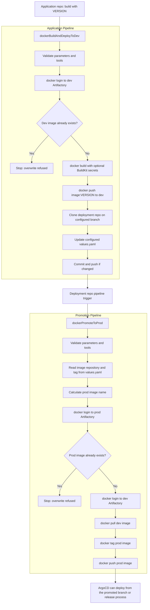

# Jenkins Shared Library for Docker, Artifactory, and ArgoCD

This repository provides a Jenkins Shared Library for a simple GitOps delivery flow:

1. Build a Docker image from an application repository.
2. Push the image to the dev Artifactory Docker repository.
3. Update one deployment values file, usually `values.yaml`, on the configured deployment branch.
4. Promote the Docker image referenced by that values file from dev Artifactory to prod Artifactory.
5. Keep promotion independent from the Git platform. The promotion pipeline does not call Git provider APIs and does not update Git.

Artifactory repositories are treated as immutable. Before pushing an image, the pipelines check whether the target image already exists and fail cleanly when it does.

## Repository Layout

```text
.
|-- Jenkinsfile.app
|-- Jenkinsfile.deployment
|-- examples
|   |-- application-repo
|   `-- deployment-repo
`-- vars
    |-- dockerBuildAndDeployToDev.groovy
    |-- dockerBuildAndDeployToDev.txt
    |-- dockerPromoteToProd.groovy
    `-- dockerPromoteToProd.txt
```

## Installation

1. Push this repository to a Git server reachable by Jenkins.
2. In Jenkins, go to **Manage Jenkins > System > Global Trusted Pipeline Libraries**.
3. Add a new library:

```text
Name: ci-shared-library
Default version: main
Retrieval method: Modern SCM
SCM: Git
Repository URL: https://github.com/thomas-illiet/jenkins-argocd.git
```

4. Save the Jenkins configuration.
5. Make sure Jenkins agents have the required tools:

```text
Application pipeline: docker, git, yq v4
Promotion pipeline: docker, yq v4
```

6. Create the Jenkins credentials described below.

The library name can be different, but Jenkinsfiles must use the same name in `@Library('...')`.

## Credentials

The pipelines expect these Jenkins credentials:

| Credential parameter | Purpose |
| --- | --- |
| `ARTIFACTORY_DEV_CREDENTIALS_ID` | `username/password` credential for Docker login to the dev Artifactory repository. |
| `ARTIFACTORY_PROD_CREDENTIALS_ID` | `username/password` credential for Docker login to the prod Artifactory repository. |
| `GIT_CREDENTIALS_ID` | `SSH Username with private key` credential for deployment Git clone and push. The pipeline binds it with `sshUserPrivateKey`. |

The application pipeline can also inject Jenkins `Secret text` credentials into Docker BuildKit secrets.

## Usage Overview

Application repositories use:

```groovy
@Library('ci-shared-library') _

dockerBuildAndDeployToDev()
```

The deployment repository uses:

```groovy
@Library('ci-shared-library') _

dockerPromoteToProd()
```

Typical deployment repository setup:

```text
deployment-repo
|-- Jenkinsfile
`-- helm
    `-- values.yaml
```

The values file does not need to be at the repository root. Configure its relative path with `VALUES_PATH`, for example `helm/values.yaml`, `charts/my-service/values.yaml`, or `environments/dev/values.yaml`.

See [examples/README.md](examples/README.md) for copyable Jenkinsfiles and a non-root `helm/values.yaml` example.

## Execution Flow



## Values File Convention

By default, the library updates and reads:

```yaml
image:
  repository: artifactory-dev.example.com/docker-dev-local/my-service
  tag: 1.2.3
```

The file path and YAML fields are configurable:

| Parameter | Default | Purpose |
| --- | --- | --- |
| `VALUES_PATH` | `values.yaml` | Relative path to the values file in the deployment repository. |
| `IMAGE_REPOSITORY_YQ_PATH` | `.image.repository` | yq path to the image repository field. |
| `IMAGE_TAG_YQ_PATH` | `.image.tag` | yq path to the image tag field. |

Nested values example:

```yaml
apps:
  myService:
    image:
      repository: artifactory-dev.example.com/docker-dev-local/my-service
      tag: 1.2.3
```

Use:

```text
VALUES_PATH=helm/values.yaml
IMAGE_REPOSITORY_YQ_PATH=.apps.myService.image.repository
IMAGE_TAG_YQ_PATH=.apps.myService.image.tag
```

For keys containing hyphens, quote the key in the yq path:

```text
IMAGE_TAG_YQ_PATH=.apps."my-service".image.tag
```

Dev and prod use the same values structure. Promotion reads the dev image reference from `VALUES_PATH`, replaces the dev Artifactory prefix with the prod Artifactory prefix, and only uploads the Docker image to the prod registry.

## Application Pipeline

`dockerBuildAndDeployToDev(Map config = [:])`:

- validates required parameters;
- checks whether the dev image tag already exists before building;
- builds the Docker image;
- supports optional Docker BuildKit `--secret` entries;
- pushes the image to dev Artifactory;
- clones the deployment repository on the configured branch;
- updates `VALUES_PATH`;
- commits and pushes only when the values file changes.

Example Jenkinsfile:

```groovy
@Library('ci-shared-library') _

dockerBuildAndDeployToDev(
    imageNameDefault: 'my-service',
    deploymentRepoUrlDefault: 'git@git.example.com:platform/deployment.git',
    deploymentBranchDefault: 'devel',
    valuesPathDefault: 'helm/values.yaml',
    imageRepositoryYqPathDefault: '.apps.myService.image.repository',
    imageTagYqPathDefault: '.apps.myService.image.tag',
    artifactoryDevRegistryDefault: 'artifactory-dev.example.com',
    artifactoryDevRepositoryDefault: 'docker-dev-local',
    gitCredentialsIdDefault: 'deployment-git-ssh'
)
```

Main parameters:

| Parameter | Description |
| --- | --- |
| `VERSION` | Required Docker image tag. |
| `IMAGE_NAME` | Docker image name, for example `my-service`. |
| `DOCKERFILE_PATH` | Dockerfile path. Default: `Dockerfile`. |
| `DOCKER_BUILD_CONTEXT` | Docker build context. Default: `.`. |
| `DOCKER_BUILD_SECRETS` | Optional Docker BuildKit `--secret` entries, one per line. |
| `DOCKER_SECRET_TEXT_CREDENTIALS` | Optional Jenkins secret text mappings, one per line. |
| `ARTIFACTORY_DEV_REGISTRY` | Dev Docker registry host, without protocol. |
| `ARTIFACTORY_DEV_REPOSITORY` | Dev Artifactory Docker repository. |
| `ARTIFACTORY_DEV_CREDENTIALS_ID` | Jenkins credentials for dev Artifactory. |
| `DEPLOYMENT_REPO_URL` | SSH URL of the ArgoCD deployment repository, for example `git@git.example.com:platform/deployment.git`. |
| `DEPLOYMENT_BRANCH` | Deployment branch to update. Default: `devel`. |
| `VALUES_PATH` | Relative path to the values file. Default: `values.yaml`. |
| `IMAGE_REPOSITORY_YQ_PATH` | yq path to the image repository field. |
| `IMAGE_TAG_YQ_PATH` | yq path to the image tag field. |
| `GIT_CREDENTIALS_ID` | Jenkins `SSH Username with private key` credential for deployment Git clone and push. |

For deployment Git access, create a Jenkins credential of type `SSH Username with private key`. The private key should be usable non-interactively by the Jenkins agent. The application pipeline uses that credential through `sshUserPrivateKey`, creates a temporary SSH wrapper, and uses a temporary `known_hosts` file with `StrictHostKeyChecking=accept-new`.

## Docker BuildKit Secrets

Create a Jenkins `Secret text` credential:

```text
ID: npm-token-credential-id
Secret: <your npm token>
```

Configure:

```text
DOCKER_SECRET_TEXT_CREDENTIALS:
NPM_TOKEN=npm-token-credential-id

DOCKER_BUILD_SECRETS:
id=npm_token,env=NPM_TOKEN
```

The shared library runs:

```sh
DOCKER_BUILDKIT=1 docker build --secret id=npm_token,env=NPM_TOKEN ...
```

Dockerfile example:

```dockerfile
# syntax=docker/dockerfile:1.4
RUN --mount=type=secret,id=npm_token \
    NPM_TOKEN="$(cat /run/secrets/npm_token)" && \
    npm config set //registry.npmjs.org/:_authToken "$NPM_TOKEN" && \
    npm ci
```

## Promotion Pipeline

`dockerPromoteToProd(Map config = [:])`:

- runs against the deployment repository workspace already checked out by Jenkins;
- reads image repository and tag from `VALUES_PATH`;
- calculates the prod image by replacing the dev Artifactory prefix with the prod Artifactory prefix;
- logs in to prod Artifactory and checks whether the target image already exists;
- fails before push if the prod image already exists;
- promotes the image with `docker pull`, `docker tag`, and `docker push`;
- does not call any Git platform API;
- does not modify or push any Git file.

Example Jenkinsfile:

```groovy
@Library('ci-shared-library') _

dockerPromoteToProd(
    valuesPathDefault: 'helm/values.yaml',
    imageRepositoryYqPathDefault: '.apps.myService.image.repository',
    imageTagYqPathDefault: '.apps.myService.image.tag',
    artifactoryDevRegistryDefault: 'artifactory-dev.example.com',
    artifactoryDevRepositoryDefault: 'docker-dev-local',
    artifactoryProdRegistryDefault: 'artifactory-prod.example.com',
    artifactoryProdRepositoryDefault: 'docker-prod-local'
)
```

Main parameters:

| Parameter | Description |
| --- | --- |
| `ARTIFACTORY_DEV_REGISTRY` | Dev Docker registry host. |
| `ARTIFACTORY_DEV_REPOSITORY` | Dev Artifactory Docker repository. |
| `ARTIFACTORY_DEV_CREDENTIALS_ID` | Jenkins credentials for dev Artifactory. |
| `ARTIFACTORY_PROD_REGISTRY` | Prod Docker registry host. |
| `ARTIFACTORY_PROD_REPOSITORY` | Prod Artifactory Docker repository. |
| `ARTIFACTORY_PROD_CREDENTIALS_ID` | Jenkins credentials for prod Artifactory. |
| `VALUES_PATH` | Relative path to the values file. Default: `values.yaml`. |
| `IMAGE_REPOSITORY_YQ_PATH` | yq path used to read the image repository. |
| `IMAGE_TAG_YQ_PATH` | yq path used to read the image tag. |

## Promotion Rules

The production promotion is refused when:

- `VALUES_PATH` does not exist in the checked-out workspace;
- `VALUES_PATH` does not contain values at `IMAGE_REPOSITORY_YQ_PATH` or `IMAGE_TAG_YQ_PATH`;
- the image repository does not start with the expected dev Artifactory prefix;
- the prod image already exists.

Image existence checks use:

```sh
docker manifest inspect "$IMAGE"
```

This prevents accidental overwrite attempts when Artifactory repositories are immutable.

The promotion copies the image to prod Artifactory. It does not delete the image from dev Artifactory and it does not update `values.yaml`.

## Recommended Tests

Application pipeline:

- run a build with `VERSION=1.2.3-test` and `IMAGE_NAME=my-service`;
- check that the image exists in dev Artifactory;
- check that `VALUES_PATH` contains the expected repository and tag;
- rerun the same version and verify the pipeline fails before building or pushing the existing dev image.

Promotion pipeline:

- run promotion with a tag that does not exist in prod and verify the image is copied from dev Artifactory to prod Artifactory;
- rerun promotion with the same tag and verify the pipeline fails before `docker push`;
- verify no file is committed by the promotion pipeline.
