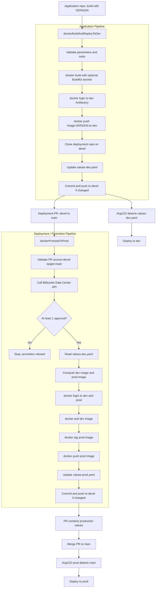

# Jenkins Shared Library for Docker, Artifactory, and ArgoCD

This repository provides a Jenkins Shared Library plus two thin Jenkinsfile examples for a Docker delivery flow:

1. Build a Docker image from an application repository.
2. Push the image to the dev Artifactory Docker repository.
3. Update the ArgoCD deployment repository on the `devel` branch.
4. Promote the Docker image from dev Artifactory to prod Artifactory when a Bitbucket Data Center PR from `devel` to `main` is approved.
5. Update production Helm values before the PR is merged into `main`.

## Repository Layout

```text
.
|-- Jenkinsfile.app
|-- Jenkinsfile.deployment
`-- vars
    |-- dockerBuildAndDeployToDev.groovy
    |-- dockerBuildAndDeployToDev.txt
    |-- dockerPromoteToProd.groovy
    `-- dockerPromoteToProd.txt
```

## Installation

1. Push this repository to GitHub, Bitbucket, or another Git server reachable by Jenkins.
2. In Jenkins, go to **Manage Jenkins > System > Global Trusted Pipeline Libraries**.
3. Add a new library:

```text
Name: ci-shared-library
Default version: main
Retrieval method: Modern SCM
SCM: Git
Repository URL: https://github.com/thomas-illiet/jenkins-argocd.git
```

4. Save the Jenkins configuration.
5. Make sure the Jenkins agents used by the jobs have the tools listed in [Jenkins Agent Requirements](#jenkins-agent-requirements).
6. Create the Jenkins credentials listed in [Jenkins Credentials](#jenkins-credentials).

The library name can be different, but the Jenkinsfiles must use the same name in `@Library('...')`.

## Usage Overview

Use this repository as the shared library repository. In each application repository, keep only a small Jenkinsfile that calls `dockerBuildAndDeployToDev()`. In the ArgoCD deployment repository, keep only a small Jenkinsfile that calls `dockerPromoteToProd()`.

Typical repository setup:

```text
application-repo
`-- Jenkinsfile

deployment-repo
|-- Jenkinsfile
|-- values-dev.yaml
`-- values-prod.yaml
```

## Jenkinsfiles

The Jenkinsfiles are intentionally small. They only load the shared library and call a reusable pipeline.

Application repository:

```groovy
@Library('ci-shared-library') _

dockerBuildAndDeployToDev()
```

Deployment repository:

```groovy
@Library('ci-shared-library') _

dockerPromoteToProd()
```

Replace `ci-shared-library` with the name configured in Jenkins under **Manage Jenkins > System > Global Trusted Pipeline Libraries** or your folder-level shared library configuration.

## Execution Flow



## Jenkins Agent Requirements

The Jenkins agents running these pipelines must provide:

- `docker`
- `git`
- `curl`
- `jq`
- `yq v4`

The application pipeline also enables Docker BuildKit during the image build:

```sh
DOCKER_BUILDKIT=1 docker build ...
```

## Jenkins Credentials

The pipelines expect Jenkins `username/password` credentials for Git, Bitbucket, and Artifactory:

| Credential parameter | Purpose |
| --- | --- |
| `ARTIFACTORY_DEV_CREDENTIALS_ID` | Docker login to the dev Artifactory repository. |
| `ARTIFACTORY_PROD_CREDENTIALS_ID` | Docker login to the prod Artifactory repository. |
| `BITBUCKET_CREDENTIALS_ID` | Git clone/push and Bitbucket Data Center API calls. |

The application pipeline can also inject Jenkins `Secret text` credentials into Docker BuildKit secrets:

| Parameter | Purpose |
| --- | --- |
| `DOCKER_SECRET_TEXT_CREDENTIALS` | Maps Jenkins secret text credentials to environment variables. |
| `DOCKER_BUILD_SECRETS` | Passes those variables or files to `docker build --secret`. |

## Helm Values Convention

The pipelines update YAML files using this shape:

```yaml
image:
  repository: artifactory.example.com/docker-repo/my-service
  tag: 1.2.3
```

Defaults:

- `values-dev.yaml` is used for dev.
- `values-prod.yaml` is used for prod.

Both paths are configurable with `VALUES_DEV_PATH` and `VALUES_PROD_PATH`.

The YAML fields themselves are also configurable through yq paths. The defaults are:

| Field | Default yq path |
| --- | --- |
| Dev image repository | `.image.repository` |
| Dev image tag | `.image.tag` |
| Prod image repository | `.image.repository` |
| Prod image tag | `.image.tag` |

Example for a nested chart values file:

```yaml
apps:
  myService:
    image:
      repository: artifactory.example.com/docker-repo/my-service
      tag: 1.2.3
```

Use these paths:

```text
DEV_IMAGE_REPOSITORY_YQ_PATH=.apps.myService.image.repository
DEV_IMAGE_TAG_YQ_PATH=.apps.myService.image.tag
PROD_IMAGE_REPOSITORY_YQ_PATH=.apps.myService.image.repository
PROD_IMAGE_TAG_YQ_PATH=.apps.myService.image.tag
```

For keys containing hyphens, quote the key in the yq path:

```text
DEV_IMAGE_TAG_YQ_PATH=.apps."my-service".image.tag
```

## Shared Library API

### `dockerBuildAndDeployToDev(Map config = [:])`

Runs the application pipeline.

Main behavior:

- validates required parameters;
- builds the Docker image;
- supports optional Docker BuildKit `--secret` entries;
- pushes the image to dev Artifactory;
- clones the deployment repository on `devel`;
- updates `values-dev.yaml` through configurable yq paths;
- commits and pushes only when the values file changes.

Example with defaults:

```groovy
@Library('ci-shared-library') _

dockerBuildAndDeployToDev()
```

Example with per-repository defaults:

```groovy
@Library('ci-shared-library') _

dockerBuildAndDeployToDev(
    imageNameDefault: 'my-service',
    deploymentRepoUrlDefault: 'https://bitbucket.example.com/scm/platform/deployment.git',
    artifactoryDevRegistryDefault: 'artifactory-dev.example.com',
    artifactoryDevRepositoryDefault: 'docker-dev-local',
    devImageRepositoryYqPathDefault: '.apps.myService.image.repository',
    devImageTagYqPathDefault: '.apps.myService.image.tag',
    dockerBuildSecretsDefault: '''
id=npm_token,env=NPM_TOKEN
''',
    dockerSecretTextCredentialsDefault: '''
NPM_TOKEN=npm-token-credential-id
'''
)
```

### `dockerPromoteToProd(Map config = [:])`

Runs the deployment promotion pipeline.

Main behavior:

- validates that the PR source branch is `devel`;
- validates that the PR target branch is `main`;
- checks Bitbucket Data Center for at least one approval;
- reads the dev image repository and tag from configurable yq paths in `values-dev.yaml`;
- promotes the image with `docker pull`, `docker tag`, and `docker push`;
- updates configurable yq paths in `values-prod.yaml`;
- commits and pushes only when the production values file changes.

Example:

```groovy
@Library('ci-shared-library') _

dockerPromoteToProd(
    bitbucketBaseUrlDefault: 'https://bitbucket.example.com',
    bitbucketProjectKeyDefault: 'PLATFORM',
    bitbucketRepoSlugDefault: 'deployment',
    artifactoryDevRegistryDefault: 'artifactory-dev.example.com',
    artifactoryDevRepositoryDefault: 'docker-dev-local',
    artifactoryProdRegistryDefault: 'artifactory-prod.example.com',
    artifactoryProdRepositoryDefault: 'docker-prod-local',
    devImageRepositoryYqPathDefault: '.apps.myService.image.repository',
    devImageTagYqPathDefault: '.apps.myService.image.tag',
    prodImageRepositoryYqPathDefault: '.apps.myService.image.repository',
    prodImageTagYqPathDefault: '.apps.myService.image.tag'
)
```

## Application Repository Usage

1. Add a Jenkinsfile to the application repository.
2. Load the shared library.
3. Call `dockerBuildAndDeployToDev()`.
4. Configure repository-specific defaults directly in the Jenkinsfile when useful.

Minimal application Jenkinsfile:

```groovy
@Library('ci-shared-library') _

dockerBuildAndDeployToDev()
```

Application Jenkinsfile with defaults:

```groovy
@Library('ci-shared-library') _

dockerBuildAndDeployToDev(
    imageNameDefault: 'my-service',
    deploymentRepoUrlDefault: 'https://bitbucket.example.com/scm/platform/deployment.git',
    artifactoryDevRegistryDefault: 'artifactory-dev.example.com',
    artifactoryDevRepositoryDefault: 'docker-dev-local',
    valuesDevPathDefault: 'helm/values-dev.yaml',
    devImageRepositoryYqPathDefault: '.apps.myService.image.repository',
    devImageTagYqPathDefault: '.apps.myService.image.tag'
)
```

At build time, provide at least:

```text
VERSION=1.2.3
IMAGE_NAME=my-service
DEPLOYMENT_REPO_URL=https://bitbucket.example.com/scm/platform/deployment.git
```

## Deployment Repository Usage

1. Add a Jenkinsfile to the ArgoCD deployment repository.
2. Load the shared library.
3. Call `dockerPromoteToProd()`.
4. Configure Bitbucket, Artifactory, and YAML defaults.
5. Configure the Jenkins job as a PR/multibranch job so Jenkins exposes `CHANGE_ID`, `CHANGE_BRANCH`, and `CHANGE_TARGET`, or pass `BITBUCKET_PR_ID` manually.

Minimal deployment Jenkinsfile:

```groovy
@Library('ci-shared-library') _

dockerPromoteToProd()
```

Deployment Jenkinsfile with defaults:

```groovy
@Library('ci-shared-library') _

dockerPromoteToProd(
    bitbucketBaseUrlDefault: 'https://bitbucket.example.com',
    bitbucketProjectKeyDefault: 'PLATFORM',
    bitbucketRepoSlugDefault: 'deployment',
    artifactoryDevRegistryDefault: 'artifactory-dev.example.com',
    artifactoryDevRepositoryDefault: 'docker-dev-local',
    artifactoryProdRegistryDefault: 'artifactory-prod.example.com',
    artifactoryProdRepositoryDefault: 'docker-prod-local',
    valuesDevPathDefault: 'helm/values-dev.yaml',
    valuesProdPathDefault: 'helm/values-prod.yaml',
    devImageRepositoryYqPathDefault: '.apps.myService.image.repository',
    devImageTagYqPathDefault: '.apps.myService.image.tag',
    prodImageRepositoryYqPathDefault: '.apps.myService.image.repository',
    prodImageTagYqPathDefault: '.apps.myService.image.tag'
)
```

## Application Pipeline Parameters

| Parameter | Description |
| --- | --- |
| `VERSION` | Required Docker image tag. |
| `IMAGE_NAME` | Docker image name, for example `my-service`. |
| `DOCKERFILE_PATH` | Dockerfile path. Default: `Dockerfile`. |
| `DOCKER_BUILD_CONTEXT` | Docker build context. Default: `.`. |
| `DOCKER_BUILD_SECRETS` | Optional Docker BuildKit `--secret` entries, one per line. |
| `DOCKER_SECRET_TEXT_CREDENTIALS` | Optional Jenkins secret text mappings, one per line. |
| `ARTIFACTORY_DEV_REGISTRY` | Dev Docker registry host, without protocol. |
| `ARTIFACTORY_DEV_REPOSITORY` | Dev Artifactory Docker repository. |
| `ARTIFACTORY_DEV_CREDENTIALS_ID` | Jenkins credentials for dev Artifactory. |
| `DEPLOYMENT_REPO_URL` | HTTPS URL of the ArgoCD deployment repository. |
| `DEPLOYMENT_BRANCH` | Deployment branch to update. Default: `devel`. |
| `VALUES_DEV_PATH` | Path to the dev values file. Default: `values-dev.yaml`. |
| `DEV_IMAGE_REPOSITORY_YQ_PATH` | yq path to the dev image repository field. Default: `.image.repository`. |
| `DEV_IMAGE_TAG_YQ_PATH` | yq path to the dev image tag field. Default: `.image.tag`. |
| `BITBUCKET_CREDENTIALS_ID` | Jenkins credentials for Git/Bitbucket. |

## Docker BuildKit Secrets

Use Docker BuildKit secrets when the Docker build needs sensitive values, such as npm tokens, Maven settings, private package registry tokens, or license keys.

### Secret text credential example

In Jenkins, create a `Secret text` credential:

```text
ID: npm-token-credential-id
Secret: <your npm token>
```

Configure the build parameters:

```text
DOCKER_SECRET_TEXT_CREDENTIALS:
NPM_TOKEN=npm-token-credential-id

DOCKER_BUILD_SECRETS:
id=npm_token,env=NPM_TOKEN
```

The shared library will run Docker with:

```sh
DOCKER_BUILDKIT=1 docker build --secret id=npm_token,env=NPM_TOKEN ...
```

Inside the Dockerfile:

```dockerfile
# syntax=docker/dockerfile:1.4
RUN --mount=type=secret,id=npm_token \
    NPM_TOKEN="$(cat /run/secrets/npm_token)" && \
    npm config set //registry.npmjs.org/:_authToken "$NPM_TOKEN" && \
    npm ci
```

### File secret example

If the Jenkins workspace already contains a secret file generated by another step, pass it directly:

```text
DOCKER_BUILD_SECRETS:
id=maven_settings,src=.jenkins/settings.xml
```

Inside the Dockerfile:

```dockerfile
# syntax=docker/dockerfile:1.4
RUN --mount=type=secret,id=maven_settings,target=/root/.m2/settings.xml \
    mvn -B package
```

Do not use Docker build arguments for sensitive values. Build args are easier to leak through image metadata, logs, or layer history. BuildKit secrets are mounted only for the `RUN` instruction that requests them.

## Deployment Pipeline Parameters

| Parameter | Description |
| --- | --- |
| `SOURCE_BRANCH` | Allowed PR source branch. Default: `devel`. |
| `TARGET_BRANCH` | Allowed PR target branch. Default: `main`. |
| `BITBUCKET_BASE_URL` | Bitbucket Data Center base URL. |
| `BITBUCKET_PROJECT_KEY` | Bitbucket project key. |
| `BITBUCKET_REPO_SLUG` | Bitbucket repository slug. |
| `BITBUCKET_PR_ID` | Optional PR id. If empty, Jenkins uses `CHANGE_ID`. |
| `BITBUCKET_CREDENTIALS_ID` | Jenkins credentials for Bitbucket API and Git push. |
| `DEPLOYMENT_REPO_URL` | Optional HTTPS repo URL. If empty, current `origin` is used. |
| `ARTIFACTORY_DEV_REGISTRY` | Dev Docker registry host. |
| `ARTIFACTORY_DEV_REPOSITORY` | Dev Artifactory Docker repository. |
| `ARTIFACTORY_DEV_CREDENTIALS_ID` | Jenkins credentials for dev Artifactory. |
| `ARTIFACTORY_PROD_REGISTRY` | Prod Docker registry host. |
| `ARTIFACTORY_PROD_REPOSITORY` | Prod Artifactory Docker repository. |
| `ARTIFACTORY_PROD_CREDENTIALS_ID` | Jenkins credentials for prod Artifactory. |
| `VALUES_DEV_PATH` | Path to the dev values file. |
| `VALUES_PROD_PATH` | Path to the prod values file. |
| `DEV_IMAGE_REPOSITORY_YQ_PATH` | yq path used to read the dev image repository. Default: `.image.repository`. |
| `DEV_IMAGE_TAG_YQ_PATH` | yq path used to read the dev image tag. Default: `.image.tag`. |
| `PROD_IMAGE_REPOSITORY_YQ_PATH` | yq path used to write the prod image repository. Default: `.image.repository`. |
| `PROD_IMAGE_TAG_YQ_PATH` | yq path used to write the prod image tag. Default: `.image.tag`. |

## Promotion Rules

The production promotion is refused when:

- the PR source branch is not `devel`;
- the PR target branch is not `main`;
- the PR has no approval in Bitbucket Data Center;
- `values-dev.yaml` does not contain values at `DEV_IMAGE_REPOSITORY_YQ_PATH` or `DEV_IMAGE_TAG_YQ_PATH`;
- the dev image repository does not start with the expected dev Artifactory prefix.

The promotion copies the image to prod Artifactory. It does not delete the image from dev Artifactory.

## Recommended Tests

### Application pipeline

Run a build with:

```text
VERSION=1.2.3-test
IMAGE_NAME=my-service
```

Check that:

- the image exists in dev Artifactory;
- `values-dev.yaml` contains the expected repository at `DEV_IMAGE_REPOSITORY_YQ_PATH`;
- `values-dev.yaml` contains the expected tag at `DEV_IMAGE_TAG_YQ_PATH`;
- rerunning the same version does not create a useless Git commit.

### Application pipeline with BuildKit secret

Run a build with:

```text
DOCKER_SECRET_TEXT_CREDENTIALS:
NPM_TOKEN=npm-token-credential-id

DOCKER_BUILD_SECRETS:
id=npm_token,env=NPM_TOKEN
```

Check that:

- the Docker build can access the secret during the mounted `RUN` step;
- the secret value is not printed in Jenkins logs;
- the secret value is not present in the final image layers.

### Deployment pipeline without approval

Create a PR from `devel` to `main` without approval.

Check that:

- the pipeline stops before promotion;
- no image is pushed to prod Artifactory;
- `values-prod.yaml` is not modified.

### Deployment pipeline with approval

Approve the PR and rerun the pipeline.

Check that:

- the image is copied from dev Artifactory to prod Artifactory;
- `values-prod.yaml` contains the prod repository at `PROD_IMAGE_REPOSITORY_YQ_PATH`;
- `values-prod.yaml` contains the tag read from `values-dev.yaml` at `PROD_IMAGE_TAG_YQ_PATH`;
- rerunning the same promotion does not create a useless Git commit.
