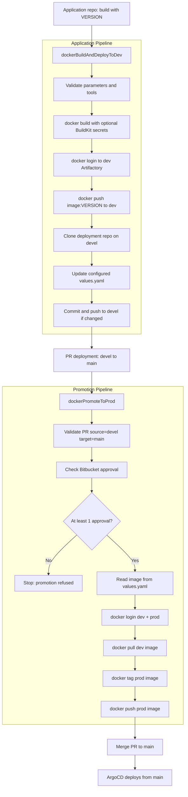

# Jenkins Shared Library for Docker, Artifactory, and ArgoCD

This repository provides a Jenkins Shared Library for a simple GitOps delivery flow:

1. Build a Docker image from an application repository.
2. Push the image to the dev Artifactory Docker repository.
3. Update one deployment values file, usually `values.yaml`, on the `devel` branch.
4. When a Bitbucket Data Center PR from `devel` to `main` is approved, promote only the Docker image from dev Artifactory to prod Artifactory.
5. Do not update Git during promotion. The PR merge carries the already-updated `values.yaml`.

## Repository Layout

```text
.
|-- Jenkinsfile.app
|-- Jenkinsfile.deployment
|-- examples
|   |-- application-repo
|   `-- deployment-repo
`-- vars
    |-- dockerBuildAndDeployToDev.groovy
    |-- dockerBuildAndDeployToDev.txt
    |-- dockerPromoteToProd.groovy
    `-- dockerPromoteToProd.txt
```

## Installation

1. Push this repository to a Git server reachable by Jenkins.
2. In Jenkins, go to **Manage Jenkins > System > Global Trusted Pipeline Libraries**.
3. Add a new library:

```text
Name: ci-shared-library
Default version: main
Retrieval method: Modern SCM
SCM: Git
Repository URL: https://github.com/thomas-illiet/jenkins-argocd.git
```

4. Save the Jenkins configuration.
5. Make sure Jenkins agents have `docker`, `git`, `curl`, `jq`, and `yq v4`.
6. Create the credentials described below.

The library name can be different, but Jenkinsfiles must use the same name in `@Library('...')`.

## Credentials

The pipelines expect Jenkins `username/password` credentials:

| Credential parameter | Purpose |
| --- | --- |
| `ARTIFACTORY_DEV_CREDENTIALS_ID` | Docker login to the dev Artifactory repository. |
| `ARTIFACTORY_PROD_CREDENTIALS_ID` | Docker login to the prod Artifactory repository. |
| `BITBUCKET_CREDENTIALS_ID` | Git clone/push and Bitbucket Data Center API calls. |

The application pipeline can also inject Jenkins `Secret text` credentials into Docker BuildKit secrets.

## Usage Overview

Application repositories use:

```groovy
@Library('ci-shared-library') _

dockerBuildAndDeployToDev()
```

The deployment repository uses:

```groovy
@Library('ci-shared-library') _

dockerPromoteToProd()
```

Typical deployment repository setup:

```text
deployment-repo
|-- Jenkinsfile
`-- helm
    `-- values.yaml
```

The values file does not need to be at the repository root. Configure its relative path with `VALUES_PATH`, for example `helm/values.yaml`, `charts/my-service/values.yaml`, or `environments/dev/values.yaml`.

See [examples/README.md](examples/README.md) for copyable Jenkinsfiles and a non-root `helm/values.yaml` example.

## Execution Flow



## Values File Convention

By default, the library updates and reads:

```yaml
image:
  repository: artifactory-dev.example.com/docker-dev-local/my-service
  tag: 1.2.3
```

The file path and YAML fields are configurable:

| Parameter | Default | Purpose |
| --- | --- | --- |
| `VALUES_PATH` | `values.yaml` | Relative path to the values file in the deployment repository. |
| `IMAGE_REPOSITORY_YQ_PATH` | `.image.repository` | yq path to the image repository field. |
| `IMAGE_TAG_YQ_PATH` | `.image.tag` | yq path to the image tag field. |

Nested values example:

```yaml
apps:
  myService:
    image:
      repository: artifactory-dev.example.com/docker-dev-local/my-service
      tag: 1.2.3
```

Use:

```text
VALUES_PATH=helm/values.yaml
IMAGE_REPOSITORY_YQ_PATH=.apps.myService.image.repository
IMAGE_TAG_YQ_PATH=.apps.myService.image.tag
```

For keys containing hyphens, quote the key in the yq path:

```text
IMAGE_TAG_YQ_PATH=.apps."my-service".image.tag
```

## Application Pipeline

`dockerBuildAndDeployToDev(Map config = [:])`:

- validates required parameters;
- builds the Docker image;
- supports optional Docker BuildKit `--secret` entries;
- pushes the image to dev Artifactory;
- clones the deployment repository on `devel`;
- updates `VALUES_PATH`;
- commits and pushes only when the values file changes.

Example Jenkinsfile:

```groovy
@Library('ci-shared-library') _

dockerBuildAndDeployToDev(
    imageNameDefault: 'my-service',
    deploymentRepoUrlDefault: 'https://bitbucket.example.com/scm/platform/deployment.git',
    deploymentBranchDefault: 'devel',
    valuesPathDefault: 'helm/values.yaml',
    imageRepositoryYqPathDefault: '.apps.myService.image.repository',
    imageTagYqPathDefault: '.apps.myService.image.tag',
    artifactoryDevRegistryDefault: 'artifactory-dev.example.com',
    artifactoryDevRepositoryDefault: 'docker-dev-local'
)
```

Main parameters:

| Parameter | Description |
| --- | --- |
| `VERSION` | Required Docker image tag. |
| `IMAGE_NAME` | Docker image name, for example `my-service`. |
| `DOCKERFILE_PATH` | Dockerfile path. Default: `Dockerfile`. |
| `DOCKER_BUILD_CONTEXT` | Docker build context. Default: `.`. |
| `DOCKER_BUILD_SECRETS` | Optional Docker BuildKit `--secret` entries, one per line. |
| `DOCKER_SECRET_TEXT_CREDENTIALS` | Optional Jenkins secret text mappings, one per line. |
| `ARTIFACTORY_DEV_REGISTRY` | Dev Docker registry host, without protocol. |
| `ARTIFACTORY_DEV_REPOSITORY` | Dev Artifactory Docker repository. |
| `DEPLOYMENT_REPO_URL` | HTTPS URL of the ArgoCD deployment repository. |
| `DEPLOYMENT_BRANCH` | Deployment branch to update. Default: `devel`. |
| `VALUES_PATH` | Relative path to the values file. Default: `values.yaml`. |
| `IMAGE_REPOSITORY_YQ_PATH` | yq path to the image repository field. |
| `IMAGE_TAG_YQ_PATH` | yq path to the image tag field. |

## Docker BuildKit Secrets

Create a Jenkins `Secret text` credential:

```text
ID: npm-token-credential-id
Secret: <your npm token>
```

Configure:

```text
DOCKER_SECRET_TEXT_CREDENTIALS:
NPM_TOKEN=npm-token-credential-id

DOCKER_BUILD_SECRETS:
id=npm_token,env=NPM_TOKEN
```

The shared library runs:

```sh
DOCKER_BUILDKIT=1 docker build --secret id=npm_token,env=NPM_TOKEN ...
```

Dockerfile example:

```dockerfile
# syntax=docker/dockerfile:1.4
RUN --mount=type=secret,id=npm_token \
    NPM_TOKEN="$(cat /run/secrets/npm_token)" && \
    npm config set //registry.npmjs.org/:_authToken "$NPM_TOKEN" && \
    npm ci
```

## Promotion Pipeline

`dockerPromoteToProd(Map config = [:])`:

- validates that the PR source branch is `devel`;
- validates that the PR target branch is `main`;
- checks Bitbucket Data Center for at least one approval;
- reads image repository and tag from `VALUES_PATH`;
- promotes the image with `docker pull`, `docker tag`, and `docker push`;
- does not modify or push any Git file.

Example Jenkinsfile:

```groovy
@Library('ci-shared-library') _

dockerPromoteToProd(
    bitbucketBaseUrlDefault: 'https://bitbucket.example.com',
    bitbucketProjectKeyDefault: 'PLATFORM',
    bitbucketRepoSlugDefault: 'deployment',
    valuesPathDefault: 'helm/values.yaml',
    imageRepositoryYqPathDefault: '.apps.myService.image.repository',
    imageTagYqPathDefault: '.apps.myService.image.tag',
    artifactoryDevRegistryDefault: 'artifactory-dev.example.com',
    artifactoryDevRepositoryDefault: 'docker-dev-local',
    artifactoryProdRegistryDefault: 'artifactory-prod.example.com',
    artifactoryProdRepositoryDefault: 'docker-prod-local'
)
```

Main parameters:

| Parameter | Description |
| --- | --- |
| `SOURCE_BRANCH` | Allowed PR source branch. Default: `devel`. |
| `TARGET_BRANCH` | Allowed PR target branch. Default: `main`. |
| `BITBUCKET_BASE_URL` | Bitbucket Data Center base URL. |
| `BITBUCKET_PROJECT_KEY` | Bitbucket project key. |
| `BITBUCKET_REPO_SLUG` | Bitbucket repository slug. |
| `BITBUCKET_PR_ID` | Optional PR id. If empty, Jenkins uses `CHANGE_ID`. |
| `BITBUCKET_CREDENTIALS_ID` | Jenkins credentials for Bitbucket API and Git clone. |
| `DEPLOYMENT_REPO_URL` | Optional HTTPS repo URL. If empty, current `origin` is used. |
| `ARTIFACTORY_DEV_REGISTRY` | Dev Docker registry host. |
| `ARTIFACTORY_DEV_REPOSITORY` | Dev Artifactory Docker repository. |
| `ARTIFACTORY_PROD_REGISTRY` | Prod Docker registry host. |
| `ARTIFACTORY_PROD_REPOSITORY` | Prod Artifactory Docker repository. |
| `VALUES_PATH` | Relative path to the values file. Default: `values.yaml`. |
| `IMAGE_REPOSITORY_YQ_PATH` | yq path used to read the image repository. |
| `IMAGE_TAG_YQ_PATH` | yq path used to read the image tag. |

## Promotion Rules

The production promotion is refused when:

- the PR source branch is not `devel`;
- the PR target branch is not `main`;
- the PR has no approval in Bitbucket Data Center;
- `VALUES_PATH` does not contain values at `IMAGE_REPOSITORY_YQ_PATH` or `IMAGE_TAG_YQ_PATH`;
- the image repository does not start with the expected dev Artifactory prefix.

The promotion copies the image to prod Artifactory. It does not delete the image from dev Artifactory and it does not update `values.yaml`.

## Recommended Tests

Application pipeline:

- run a build with `VERSION=1.2.3-test` and `IMAGE_NAME=my-service`;
- check that the image exists in dev Artifactory;
- check that `VALUES_PATH` contains the expected repository and tag;
- rerun the same version and check that no useless Git commit is created.

Promotion pipeline:

- create a PR from `devel` to `main` without approval and verify promotion is refused;
- approve the PR and verify the image is copied from dev Artifactory to prod Artifactory;
- verify no file is committed by the promotion pipeline.
